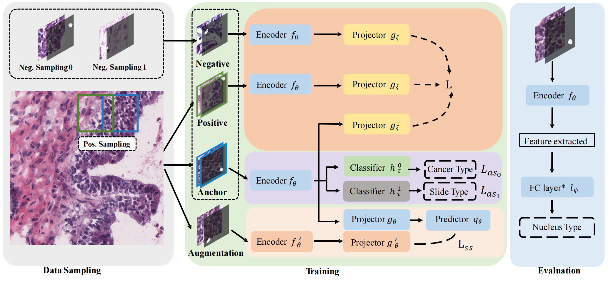
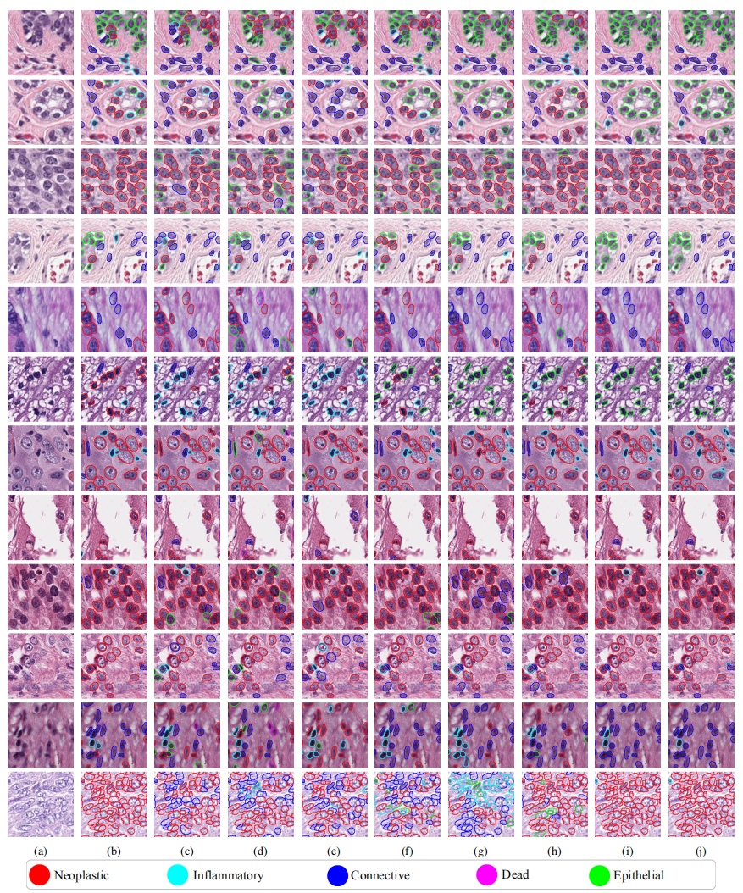

# Knowledge Based Representation Learning for Nucleus Instance Classification from Histopathological Images

This repository contains PyTorch code for the paper:
Knowledge Based Representation Learning for Nucleus Instance Classification from Histopathological Images

In this paper, we proposed a new framework for nucleus representation learning. We propose a new four-channel
 structured input and design Structured Triplet based on this input. We also add two auxiliary branches: the slide
  attribute learning branch and the conventional self-supervision branch, to further improve the representation encoder.



Links to the checkpoints can be found in the inference description below.


## Set Up Environment

```
conda env create -n structured_triplet
conda activate structured_triplet
pip install torch torchvision
pip install tensorboard
pip install scikit-learn
pip install opencv
```


## Repository Structure

Below are the main directories in the repository: 

- `dataset/`: the data loader and augmentation pipeline
- `tolls/`: warm up training script and the main training script
- `models/`: model definition 
- `utils/`: defines the utility function 

# Running the Code

## Training

###  Dataset preparation
- Download our [dataset](dataset/LarSPI/README.md) and place it in a local accessible directory, e.g., /dataset/LarSPI
- Download the annotated dataset to evaluate on, e.g. panNuke or CoNSeP

### Usage and Options

Usage: <br />
```
python tools/byol_warmup.py --root /dataset/LarSPI
python tools/train.py --root /dataset/LarSPI
```

Options:
```
  --name        The name of the experiment.
  --byol_name   The name of the warm up process
  --lr          Setting the learning rate.  
  --batch_size  Setting the batch size.
  --max_epoch   Setting the epochs to train.
  --alpha       Setting the hyperparameter alpha
  --beta        Setting the hyperparameter beta
  --resnet      Setting the backbone of the framework
```


## Inference

  
### Model Weights

As part of our work, we provide the trained model at the link below: 
- [checkpoint](https://drive.google.com/file/d/1-z3ZbSeNN6I_foJmRC0Wgo1NJ0Pt9d_t/view?usp=sharing)


### Usage and Options
```
  python tools/train.py --root_eval /dataset/panNuke
```


## Overlaid Classification Prediction

<p float="left">
  
</p>

Results of different classification methods on histopathological patches of 40 in PanNuke. (a) Input patch (b) SimCLR. (c) Moco (d)Moco v2 (e) BYOL (f) RCCNet (g) ViT (h) BiT (i) Structured-Triplet (j) Ground truth.


## Comparison

Below we report the difference in accuracy of different classification methods at 40x slide scale. 

|            | PanNuke    |            |           | CoNSeP    |            |           |
| -----------|----------- | -----------|-----------|-----------|------------|-----------|
|            | Precision  | Recall     | F1        |Precision  | Recall     |F1         |
| SimCLR     | 0.7102     | 0.6947     | 0.6999    |0.5879     | 0.6400     | 0.6550    |
| Moco       | 0.6190     | 0.5840     | 0.5962    |0.6262     | 0.5632     | 0.5853    |
| Moco v2    | 0.6224     | 0.6086     | 0.6117    |0.5704     | 0.5352     | 0.5430    |
| BYOL       | 0.6582     | 0.5910     | 0.6121    |0.6223     | 0.5402     | 0.5713    |
| ViT        | 0.7403     | 0.7215     | 0.7271    |0.5910     | 0.5717     | 0.5796    |
| BiT        | 0.7301     | 0.7139     | 0.7191    |0.6780     | 0.6430     | 0.6578    |
| Ours       | 0.7720     | 0.7659     | 0.7684    |0.7230     | 0.6678     | 0.6838    |


## Acknowledgement
Our code on the byol branch is modified from [byol-pytorch](https://github.com/lucidrains/byol-pytorch).


## Citation

If any part of this code is used, please give appropriate citation to our paper. <br />

```
@ARTICLE{9869632,
  author={Zhang, Wenhua and Zhang, Jun and Yang, Sen and Wang, Xiyue and Yang, Wei and Huang, Junzhou and Wang, Wenping and Han, Xiao},
  journal={IEEE Transactions on Medical Imaging}, 
  title={Knowledge-Based Representation Learning for Nucleus Instance Classification from Histopathological Images}, 
  year={2022},
  volume={},
  number={},
  pages={1-1},
  doi={10.1109/TMI.2022.3201981}}
```

## Authors

* [Wenhua Zhang](https://github.com/WinnieLaugh)

## License

The dataset provided here is for research purposes only. Commercial use is not allowed. The data is held under the following license:
[Attribution-NonCommercial-ShareAlike 4.0 International](https://creativecommons.org/licenses/by-nc-sa/4.0/)


